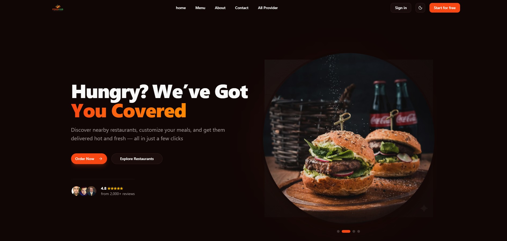

<h1 align="center">
  🍔 FoodHub — Modern Food Ordering Platform
</h1>

<p align="center">
  <strong>A full-featured, production-ready food ordering web application built with Next.js 16, React 19, and TypeScript.</strong>
</p>

<p align="center">
  
  
  
  
</p>

<p align="center">
  <a href="#-live-demo">Live Demo</a> •
  <a href="#-overview--problem-statement">Overview</a> •
  <a href="#-architecture--scalability">Architecture</a> •
  <a href="#-features">Features</a> •
  <a href="#-tech-stack">Tech Stack</a> •
  <a href="#-getting-started">Getting Started</a>
</p>

---

## 🚀 Live Demo

**[👉 Try FoodHub Live](https://foodhub-frontend-omega.vercel.app/)**

> **Demo Access:** You can instantly test the platform without registering. Navigate to the Sign-in page and use the built-in **Demo Login buttons** to seamlessly switch between **Customer**, **Provider**, and **Admin** roles.

<p align="center">
  
</p>

---

## 📖 Overview & Problem Statement

**The Problem:** Traditional food ordering applications often suffer from fragmented experiences—customers face clunky navigation, food providers lack intuitive menu management tools, and administrators have poor visibility into platform operations.

**The Solution (FoodHub):** FoodHub bridges this gap by offering a modern, unified ecosystem. It connects customers with food providers through an aesthetically pleasing public storefront, provides a robust customer dashboard, and features a powerful role-based admin panel for seamless platform management.

---

## 🏗️ Architecture & Scalability

FoodHub is designed with modern system design principles to ensure scalability, security, and high performance:
- **Server Components (RSC):** Leverages Next.js 16 App Router to reduce client-side bundle size and improve page load speeds.
- **Parallel Routing:** Utilizes Next.js parallel routes (`@admin`) to securely and efficiently render complex role-based dashboards (Admin vs Customer).
- **Data Validation & Security:** Strict runtime validation for environment variables (`@t3-oss/env-nextjs`) and API requests (Zod) prevents configuration-based crashes and injection vulnerabilities.
- **Secure Authentication:** Implements HTTP-only cookie-based session management using `better-auth`, protecting against common XSS and CSRF attacks.

---

## 🔥 Standout & Unique Features

- **Frictionless Multi-Role Demo System:** Instead of requiring recruiters or users to register, the app features 1-click Demo Login buttons. This allows instant exploration of the application across three distinct permission tiers (Customer, Provider, Admin).
- **Parallel Routing for Dashboards:** Uses advanced Next.js 16 Parallel Routes (`@admin`) to natively stream distinct dashboard layouts based on role authorization, avoiding clunky client-side redirects or nested layout thrashing.
- **End-to-End Type Safety:** Enforces strict Zod schema validation starting from server-side environment variables (`@t3-oss/env-nextjs`) to complex UI forms (`react-hook-form`), completely eliminating a whole class of runtime errors.

---

## ✨ Core Features

### 🌍 Public Storefront
- **Hero Section** — Eye-catching landing banner with call-to-action
- **Food Listings** — Browse all available food items with filtering by cuisine and dietary preferences
- **Food Detail Page** — Rich product details with images, description, pricing, and reviews
- **Gallery Section** — Visual showcase of featured dishes
- **Services Section** — Overview of platform offerings
- **CTA Section** — Conversion-focused call-to-action block

### 👤 Customer Features
- **Authentication** — Secure sign-up and sign-in powered by `better-auth`
- **Profile Management** — View and edit personal profile settings
- **Cart** — Add items to cart and manage orders
- **My Orders** — Track current and past orders
- **Provider View** — Browse food providers and their menus
- **Provider Stats** — View provider-specific analytics

### 🛡️ Admin Dashboard
- **Admin Stats** — Platform-wide analytics and revenue overview
- **Manage Users** — View and administer user accounts
- **Manage Categories** — Add, edit, and delete food categories
- **View Orders** — Monitor and manage all platform orders
- **Parallel Routes** — Role-based dashboard rendering (Admin vs. Customer) using Next.js parallel routes

### 🔧 Developer Experience
- **Type-safe Environment** — All env vars validated with `@t3-oss/env-nextjs` + Zod
- **Data Tables** — Feature-rich sortable/filterable tables via `@tanstack/react-table`
- **Forms** — Validated forms with `react-hook-form` + `@hookform/resolvers` + Zod schemas
- **Charts** — Analytics charts powered by `recharts`
- **Animations** — Smooth UI animations with `motion` (Framer Motion) and GSAP
- **Toast Notifications** — Non-blocking feedback with `sonner`

---

## 🛠️ Tech Stack

| Category | Technology |
|---|---|
| **Framework** | [Next.js 16](https://nextjs.org/) (App Router) |
| **Language** | TypeScript 5 |
| **UI Library** | React 19 |
| **Styling** | Tailwind CSS v4 + `tw-animate-css` |
| **Component Library** | Shadcn/UI (Radix UI) |
| **Authentication** | [better-auth](https://www.better-auth.com/) |
| **Form Handling** | React Hook Form + Zod |
| **Data Tables** | TanStack Table v8 |
| **Animations** | Motion (Framer Motion) + GSAP |
| **Charts** | Recharts |
| **Icons** | Lucide React + Iconify |
| **Carousel** | Embla Carousel |
| **Toast** | Sonner + Goey Toast |
| **Env Validation** | @t3-oss/env-nextjs |
| **Linting** | ESLint 9 |
| **Package Manager** | npm |

---

## 📁 Project Structure

```
foodhub-frontend/
├── src/
│   ├── app/
│   │   ├── (commondLayout)/          # Public pages with Navbar + Footer
│   │   │   ├── page.tsx              # Home page
│   │   │   ├── allFood/              # Food listing & detail pages
│   │   │   │   └── [id]/            # Dynamic food detail route
│   │   │   ├── cart/                 # Shopping cart
│   │   │   ├── my-order/             # Customer order history
│   │   │   ├── my-menu/              # Provider menu management
│   │   │   ├── add-menu/             # Add food item (provider)
│   │   │   ├── profile/              # User profile
│   │   │   ├── editProfile/          # Edit profile
│   │   │   ├── provider/             # Browse providers
│   │   │   ├── providerStats/        # Provider analytics
│   │   │   ├── register/             # Registration page
│   │   │   ├── signin/               # Sign-in page
│   │   │   └── allProvider/          # All providers listing
│   │   ├── (dashboardLayout)/        # Admin dashboard with sidebar
│   │   │   ├── layout.tsx            # Sidebar layout (role-based)
│   │   │   └── @admin/               # Parallel route for admin
│   │   │       └── dashboard/
│   │   │           ├── adminStats/   # Platform analytics
│   │   │           ├── manageUser/   # User management
│   │   │           ├── manageCategories/ # Category management
│   │   │           ├── addCategories/    # Add category form
│   │   │           └── viewOrder/    # Order management
│   │   ├── lib/
│   │   │   └── auth-client.ts        # Better-auth client setup
│   │   ├── globals.css               # Global styles
│   │   └── layout.tsx                # Root layout
│   └── constants/                    # Type definitions & constants
├── components/
│   ├── ui/                           # Shadcn/UI base components
│   ├── shadcn-space/                 # Extended block components
│   │   └── blocks/                   # Gallery, CTA, Footer blocks
│   ├── module/                       # Feature modules
│   │   └── food-section/             # Food listing section
│   ├── commerce-ui/                  # E-commerce UI primitives
│   ├── navbar5.tsx                   # Main navigation bar
│   ├── app-sidebar.tsx               # Dashboard sidebar
│   ├── hero1.tsx                     # Hero section
│   ├── product-card1.tsx             # Food card component
│   ├── product-detail1.tsx           # Food detail component
│   ├── data-table1.tsx               # Reusable data table
│   ├── category-table.tsx            # Categories table
│   ├── cuisine-filter.tsx            # Cuisine filter component
│   ├── dietary-filter.tsx            # Dietary filter component
│   ├── stats-10.tsx                  # Stats display component
│   └── settings-profile1.tsx         # Profile settings form
├── services/                         # API service layer
│   ├── food.service.ts               # Food CRUD operations
│   ├── order.service.ts              # Order management
│   ├── cart.service.ts               # Cart operations
│   ├── category.service.ts           # Category operations
│   ├── profile.service.ts            # User profile API
│   ├── review.service.ts             # Review management
│   ├── user.service.ts               # User/session API
│   ├── adminStats.service.ts         # Admin analytics API
│   ├── providerStats.service.ts      # Provider analytics API
│   └── userProfileStatus.service.ts  # Profile status API
├── hooks/                            # Custom React hooks
├── lib/                              # Utility functions
├── server action/                    # Next.js server actions
├── env.ts                            # Type-safe env config
├── next.config.ts                    # Next.js configuration
└── package.json
```

---

## 🚀 Getting Started

### Prerequisites

- **Node.js** >= 18.x
- **npm** >= 9.x
- A running instance of the **FoodHub Backend** API

### Installation

1. **Clone the repository**

   ```bash
   git clone https://github.com/your-username/foodhub-frontend.git
   cd foodhub-frontend
   ```

2. **Install dependencies**

   ```bash
   npm install
   ```

3. **Set up environment variables**

   Copy the example env file and fill in the required values:

   ```bash
   cp .env.example .env
   ```

   See the [Environment Variables](#-environment-variables) section below for details.

4. **Run the development server**

   ```bash
   npm run dev
   ```

   Open [http://localhost:3000](http://localhost:3000) in your browser.

---

## ⚙️ Environment Variables

Create a `.env` file in the project root with the following variables:

```env
# ─── Server-Side Variables ───────────────────────────────────────────────────
# The base URL of your backend API (server-side only)
BACKEND_URL=http://localhost:5000

# The URL of the frontend application (server-side)
FRONTEND_URL=http://localhost:3000

# The URL used for Better Auth API routes (server-side)
AUTH_URL=http://localhost:3000/api/auth

# ─── Client-Side Variables ───────────────────────────────────────────────────
# The public API base URL accessible from the browser
NEXT_PUBLIC_API_URL=http://localhost:5000

# The public frontend URL (optional, used for auth redirect)
NEXT_PUBLIC_FRONTEND_URL=http://localhost:3000

# The public backend URL (used for API rewrites)
NEXT_PUBLIC_BACKEND_URL=http://localhost:5000

# Test variable (required by env schema)
NEXT_PUBLIC_TEST=your_test_value
```

> **Note:** All environment variables are validated at build time using `@t3-oss/env-nextjs` with Zod schemas. The application will throw an error on startup if any required variable is missing or malformed.

---

## 🗺️ Routes

### Public Routes

| Route | Description |
|---|---|
| `/` | Home page — Hero, Food section, Gallery, CTA, Services |
| `/allFood` | Browse all available food items |
| `/allFood/[id]` | Individual food item detail page |
| `/provider` | Browse all food providers |
| `/allProvider` | Full provider listing |
| `/signin` | User sign-in |
| `/register` | New user registration |

### Authenticated Routes

| Route | Description |
|---|---|
| `/cart` | Shopping cart |
| `/my-order` | Customer order history |
| `/profile` | User profile view |
| `/editProfile` | Edit user profile |
| `/my-menu` | Provider's own menu |
| `/add-menu` | Add a new food item (providers) |
| `/providerStats` | Provider analytics dashboard |

### Admin Dashboard Routes

| Route | Description |
|---|---|
| `/dashboard` | Admin/User dashboard entry point |
| `/dashboard/adminStats` | Platform-wide analytics & revenue |
| `/dashboard/manageUser` | User management panel |
| `/dashboard/manageCategories` | Food category management |
| `/dashboard/addCategories` | Add a new food category |
| `/dashboard/viewOrder` | View and manage all orders |

> **Role-Based Access:** The dashboard automatically renders the **Admin panel** for users with the `Admin` role, and the standard **user dashboard** for regular customers, using Next.js [Parallel Routes](https://nextjs.org/docs/app/building-your-application/routing/parallel-routes).

---

## 🔐 Authentication

FoodHub uses [**better-auth**](https://www.better-auth.com/) for authentication. Auth routes are proxied through Next.js rewrites:

```
/api/auth/* → NEXT_PUBLIC_BACKEND_URL/api/auth/*
```

The auth client is configured in `src/app/lib/auth-client.ts` and uses session-based authentication with HTTP-only cookies (`credentials: "include"`).

---

## 📜 Available Scripts

| Script | Description |
|---|---|
| `npm run dev` | Start the development server at `localhost:3000` |
| `npm run build` | Create an optimized production build |
| `npm run start` | Start the production server |
| `npm run lint` | Run ESLint on the codebase |

---

## 🤝 Contributing

Contributions are welcome! Please follow these steps:

1. Fork the repository
2. Create your feature branch (`git checkout -b feature/amazing-feature`)
3. Commit your changes (`git commit -m 'feat: add amazing feature'`)
4. Push to the branch (`git push origin feature/amazing-feature`)
5. Open a Pull Request

---

## 📄 License

This project is open source and available under the [MIT License](LICENSE).

---

<p align="center">
  Built with ❤️ using <strong>Next.js</strong> & <strong>React</strong>
</p>
